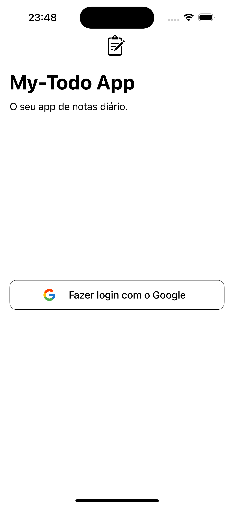
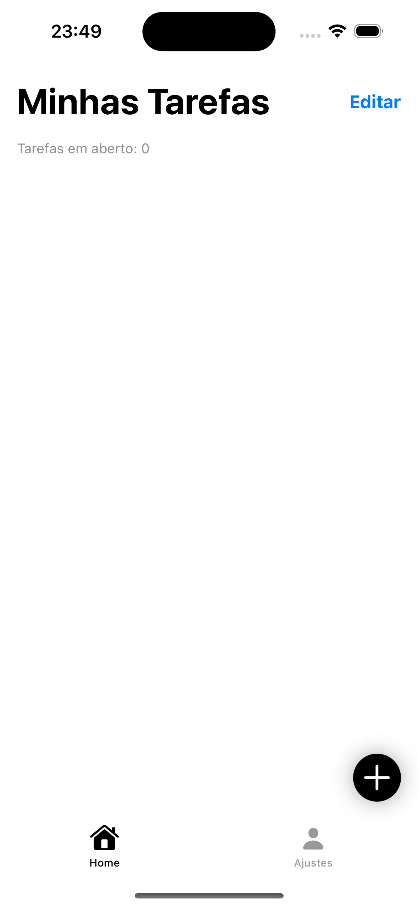
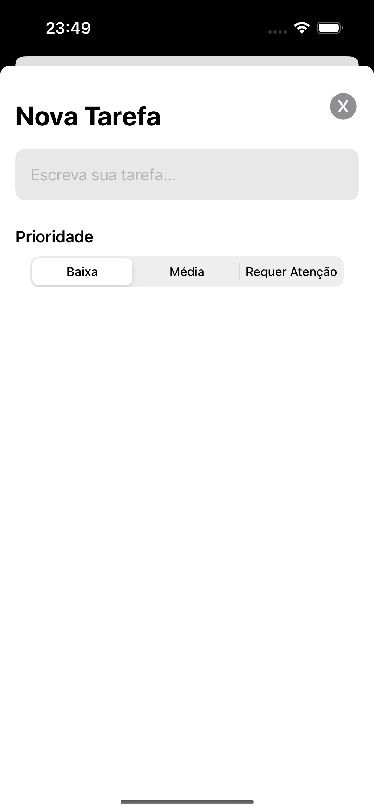
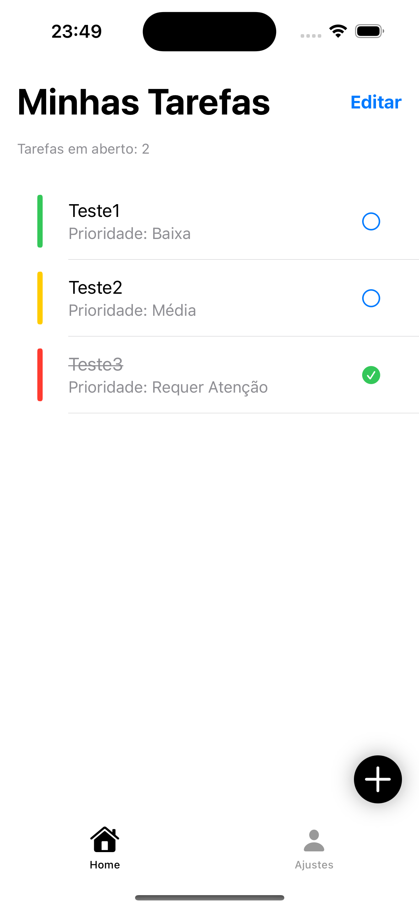

<h1 align="center">My Todo App</h1>

## About 📄   <h4>App de notas desenvolvido em Swift ( SwiftUI ), de um app de notas, para o desafio Game of fronts.</h4>

## Technologies 🛠️

- [Swif](https://www.apple.com/br/swift/)
- [Firebase](https://firebase.google.com/?hl=pt-br)

## How to run this application? 🚀

- In the terminal run this command

  -  `git clone (https://github.com/newlandslucas/My-Todo-List.git)`

- Open that folder in your XCode
- Run & Build Project
   -  `command + R `

## Prints 📱

    

## Author 👨🏻‍💻

   [Lucas Newlands](https://github.com/newlandslucas)
